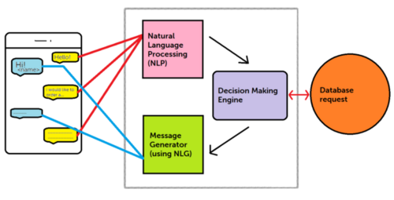

Poojitha Konduparti

## Introduction 

Chatbots are computer programs that use natural language processing (NLP) to simulate conversation with human users. They are designed to understand and interpret the language and intent of a user's input, and to generate appropriate responses in real-time. Chatbots are increasingly being used in a variety of applications, such as customer service, e-commerce, and online education, to automate and improve the user experience.

NLP is a subfield of artificial intelligence that focuses on the interaction between computers and human language. It involves using a combination of linguistic and machine learning techniques to process and analyze natural language data, such as text or speech, in order to extract meaning and identify patterns. NLP is a critical component of chatbot technology, as it enables chatbots to understand and respond to user inputs in a way that is natural and intuitive.

In summary, chatbots and NLP are closely related technologies that are transforming the way we interact with computers. By using NLP to enable chatbots to understand and respond to human language, we can create more efficient and effective tools for automating a wide range of tasks and applications.

## Methods

The article I have written implements 2 approaches:
1. Using Hugging Face Transformers
2. Using Simple Tokenizers

## Results
We have 2 working Conversational Chatbots 

## References

1. https://www.youtube.com/watch?v=pOUBt-S5dHY
2. https://www.upgrad.com/blog/how-to-make-chatbot-in-python/
3. https://www.section.io/engineering-education/creating-chatbot-using-natural-language-processing-in-python/
4. https://www.analyticsvidhya.com/blog/2021/11/learn-how-to-build-your-discord-bot/
5. https://github.com/kingabzpro/DailoGPT-RickBot
6. https://www.mygreatlearning.com/blog/bag-of-words/

